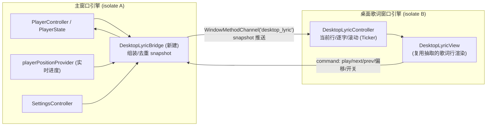

# 桌面歌词接入方案

> 评估日期：2026-09-29
> 参考项目：`D:\work\EchoMusic`（Electron + Vue + Rust NAPI，已实现成熟的桌面歌词）
> 目标：在 kugo（Flutter）上实现**真正的桌面歌词**——独立于主窗口、悬浮于所有应用之上、可置顶、可锁定穿透、支持逐字（卡拉OK）渲染。

---

## 1. 现状盘点

### 1.1 已具备的基础（可直接复用）

| 能力 | 位置 | 说明 |
|---|---|---|
| 全局播放状态 | `features/player/player_controller.dart` | `PlayerState`：queue、currentIndex、display、mode、volume、`lyrics`、`lyricsStatus` |
| 实时进度 | `controller.position`（`ValueListenable`）/ `playerPositionProvider` | 离散游标与实时 tick 分离，适合歌词窗低开销订阅 |
| 歌词模型 | `core/models/track.dart` `LyricLine` / `LyricChar` | timeMs、endMs、text、**chars 逐字时间轴**、translated 译文、romanized 音译；`sungCharCount()` 已实现 |
| 歌词解析 | `core/utils/lrc_parser.dart`、`krc_parser.dart` | LRC 解析、KRC 解密（XOR+zlib）与翻译/音译块解析、`findLyricIndex()` |
| 应用内歌词渲染 | `shared/widgets/lyrics_view.dart` | 逐字卡拉OK填充、上下渐隐 `ShaderMask`、手动浏览后自动回归——**行渲染逻辑可抽取共用** |
| 窗口管理 | `window_manager 0.5.x` | 无边框、隐藏标题栏、`setIgnoreMouseEvents`、preventClose、置顶 |
| 系统托盘 | `shared/tray/desktop_tray.dart`（`tray_manager`） | 完整菜单，可直接加"桌面歌词"开关项 |
| 窗口材质 | `flutter_acrylic` | Win11 Mica / Win10 Acrylic |
| 原生通道先例 | `windows/runner/taskbar_host.*`、`shared/taskbar/taskbar_bridge.dart` | 项目已有 C++ 原生通道 + Dart 桥的成熟模式，新增 Win32 通道可照此办理 |
| 平台判断 | `core/platform.dart` | `isDesktopPlatform` / `isWindowsPlatform` |

### 1.2 缺口（本方案要解决的）

1. **没有多窗口能力**。现有的 `features/mv/mv_mini_window.dart` 只是主窗口 `Stack` 内的 overlay，无法覆盖到其他应用之上——不满足桌面歌词的本质。
2. `pubspec.yaml` 里的 `floating: ^6.0.0` 是 **Android 画中画专属插件（Android only）**，与桌面无关，不能用于本功能。
3. `window_manager` 在 Windows 上的 `setIgnoreMouseEvents` 只有**纯穿透**（`WS_EX_TRANSPARENT | WS_EX_LAYERED`），**没有 Electron 的 `forward` 能力**（穿透状态下仍能收到 mousemove，用于 hover 出控制条）。
4. 没有桌面歌词的开关入口、设置项、窗口位置持久化。

---

## 2. EchoMusic 实现拆解（参考要点）

EchoMusic 的桌面歌词由四块组成：

### 2.1 独立窗口（`src/main/desktopLyric/window.ts`）
- 独立入口 `desktop-lyric.html` + 独立 Vue 路由，与主窗口完全隔离的渲染进程。
- 窗口参数：`frame:false`、`transparent:true`、`backgroundColor:#00000000`、`hasShadow:false`、`skipTaskbar:true`、`fullscreenable/minimizable/maximizable:false`。
- 置顶：`setAlwaysOnTop(true, 'screen-saver')`，并在多个延时点（0/120/800ms）**重复重挂（restack）**，防止被其他置顶窗口/全屏应用抢层级。
- macOS：`type:'panel'` + `setVisibleOnAllWorkspaces(..., visibleOnFullScreen:true)`；Linux：`type:'toolbar'`；Wayland 下置顶/定位受协议限制，只能交给合成器。

### 2.2 状态桥（核心，`src/main/desktopLyric.ts`）
- 主进程维护**唯一 snapshot**：`{ playback, lyricsTrackId, lyricsRevision, lyrics, currentIndex, lyricTimeOffset, settings, lockPhase }`。
- 主渲染进程通过 IPC `desktop-lyric:sync-snapshot` 上报 → 主进程做**版本校验 / 去重 / 桥接过渡（playback bridge）** → 广播 `desktop-lyric:snapshot` 给歌词窗口。
- 歌词窗口的控制命令（播放/上下首/译文开关/歌词偏移）通过 IPC `desktop-lyric:command` **回传主窗口执行**，歌词窗自身不碰播放。
- 切歌时以 `lyricHash/trackId` 判定，清空旧歌词并递增 `lyricsRevision`，防止旧词残留。

### 2.3 锁定与点击穿透（交互难点）
- **未锁定**：窗口正常可交互，渲染层手势驱动拖拽/缩放。
- **锁定**：`setIgnoreMouseEvents(true, {forward:true})`——点击穿透到下层，但 `forward` 把鼠标移动事件继续转发给渲染进程；光标 hover 到歌词行时浮出半透明控制条与"解锁"按钮，鼠标离开后恢复穿透。
- **Linux X11 无 forward**：主进程以 ~150ms 轮询光标坐标，仅当光标落在"解锁按钮矩形"内时临时关闭穿透（其余区域始终穿透）。
- 另有光标轮询兜底，规避 `mouseleave` 在穿透状态下不可靠的问题。

### 2.4 工程细节（成熟度所在）
- `ready-to-show` 后才显示，且用 `showInactive()`（不抢焦点），杜绝黑/灰闪烁。
- 窗口 bounds 持久化：Windows 监听 `moved/resized`（操作结束一次性触发），避免 move/resize 高频触发 + DPI 缩放导致坐标漂移；Wayland 只存尺寸不存坐标。
- 监听 display 增删 / `display-metrics-changed`，把窗口边界**约束回可见显示器**。
- 渲染进程 `unresponsive` / `render-process-gone` 时自动销毁重建。
- 歌词偏移（±步进/重置）、译文/音译独立开关；渲染层用 requestAnimationFrame 驱动当前行、逐字进度与滚动。

---

## 3. 技术选型

### 3.1 结论：采用 `desktop_multi_window`（mixin.dev，最新 0.3.x）

| 方案 | 评价 |
|---|---|
| **`desktop_multi_window` ✅ 推荐** | Win/macOS/Linux 全支持；每窗口独立 Flutter 引擎 + isolate；提供 `WindowController` 生命周期管理与 `WindowMethodChannel` 窗口间通信（正好对应 EchoMusic 的 IPC）；子窗口内可继续用 `window_manager` 控制样式；社区桌面歌词先例最多 |
| Flutter 官方实验性 Windowing API | 2026 年仍需 `flutter config --enable-windowing` 开启、未稳定，API 可能变动，不建议现在押注 |
| `window_manager_plus` | 多窗口 fork（含 `setIgnoreMouseEvents(ignore, forward)`），但维护生态小、下载量低 |
| 单窗口内 overlay（同 MvMiniWindow） | 无法覆盖其他应用，**不满足需求**，排除 |

> 多引擎成本：歌词窗额外约 20–40MB 内存，可接受。音频引擎（media_kit）、托盘等只在主窗口运行，子窗口仅承载 UI。

### 3.2 引入与原生注册（必做）

1. `pubspec.yaml` 增加 `desktop_multi_window: ^0.3.0`。
2. **Windows**：修改 `windows/runner/flutter_window.cpp`，在 `OnCreate()` 中注册窗口创建回调，为每个新引擎注册插件：
   ```cpp
   #include "desktop_multi_window/desktop_multi_window_plugin.h"
   // ...
   RegisterPlugins(flutter_controller_->engine());
   DesktopMultiWindowSetWindowCreatedCallback([](void *controller) {
     auto *flutter_view_controller =
         reinterpret_cast<flutter::FlutterViewController *>(controller);
     RegisterPlugins(flutter_view_controller->engine());
   });
   ```
   macOS（`MainFlutterWindow.swift`）/ Linux（`my_application.cc`）同理，见插件 README。
3. `main()` 改为按窗口参数分流（多窗口插件的标准入口）：
   ```dart
   final controller = await WindowController.fromCurrentEngine();
   final args = parseWindowArgs(controller.arguments); // 主窗口为空，歌词窗为 {"type":"desktop_lyric"}
   switch (args.type) {
     case WindowType.main:  runApp(主窗口 App 并完成现有全部初始化);
     case WindowType.lyric: runApp(const DesktopLyricApp()); // 轻量入口，不初始化音频/托盘
   }
   ```

> ⚠️ 实测点：`desktop_multi_window` 官方 README 建议子窗口配合其指定的 `window_manager` fork（修复句柄绑定）。当前 0.5.2 的 Windows 端在 `ensureInitialized` 时用 `GetAncestor(view, GA_ROOT)` 绑定**当前引擎所在根窗口**，理论上子窗口可直接用。**开工第一步先做最小 spike 验证**（子窗内调用 window_manager 能否作用于自身、能否透明）；若不通过再切官方推荐 fork。

---

## 4. 目标架构



### 4.1 主窗口侧：`DesktopLyricBridge`（新增，建议放 `features/desktop_lyric/`）

职责（对齐 EchoMusic 主进程）：
- 监听 `playerControllerProvider` 与 `playerPositionProvider`，组装 snapshot：
  `{ trackId, lyricHash, isPlaying, positionMs, durationMs, lyrics(轻量序列化), settings }`。
- **去重/节流**：歌词、设置等离散变化即时推；position 高频，按 ~50–100ms 节流或仅在歌词窗需要时推（歌词窗也可只接收切歌/seek 事件，播放中用本地 Ticker 自走，进一步降低通道压力——推荐这种"对时 + 本地走"模式）。
- 切歌判定（trackId / lyricHash）：变化时清空旧词、递增 revision。
- 接收歌词窗回传命令，调用 `PlayerController`（togglePlay/next/previous/setMode/seek）与 `SettingsController`（译文/音译/偏移）。
- 管理歌词窗生命周期：创建、显示、隐藏、销毁，窗口 id 缓存。

### 4.2 歌词窗口侧：`DesktopLyricApp`（新增 `features/desktop_lyric/lyric_window/`）

- 轻量 `ProviderContainer` + 最小 Widget 树（不引入路由/托盘/音频）。
- `DesktopLyricController`：持有最近 snapshot，用 `Ticker`/`Timer` 驱动；
  - 对时：收到 position snapshot 校准本地时钟，播放中本地自走，每 ~200ms 或 seek/暂停时再对时。
  - 当前行索引：复用 `findLyricIndex()`；逐字进度复用 `LyricLine.sungCharCount()`。
- View：默认**双行**（当前行 + 下一行，桌面歌词主流形态），可切单行；锁定时 hover 浮出控制条（锁/解锁、播放暂停、上一首/下一首、关闭、歌词偏移、设置入口）。

### 4.3 渲染复用（建议顺手重构）

把 `lyrics_view.dart` 中"单行歌词"的绘制（主/副行文本、逐字卡拉OK填充、译文/音译）抽取为共享 widget，如 `shared/widgets/lyric_line_painter.dart`：
- 应用内 `LyricsView` 与桌面歌词窗共用同一套绘制，保证效果一致、后续单点维护。
- 逐字填充建议用 `TextPainter` + `Canvas`（或现有 Stack 双层文字 + ClipRect）绘制，描边/阴影支持桌面浅色壁纸下的可读性。

---

## 5. 关键技术点（Windows 为主）

### 5.1 无边框 / 透明 / 置顶 / 隐藏任务栏
歌词窗 `runApp` 后、首帧前：
```dart
await windowManager.ensureInitialized(); // 绑定到歌词窗自身 HWND（见 3.2 实测点）
await windowManager.setAsFrameless();
await windowManager.setBackgroundColor(Colors.transparent);
await windowManager.setAlwaysOnTop(true);
await windowManager.setSkipTaskbar(true);
await windowManager.show(); // 首帧就绪后再 show，防黑闪
```
- Windows 透明原理（window_manager）：`SetWindowCompositionAttribute` + `ACCENT_ENABLE_TRANSPARENTGRADIENT`（alpha=0）。
- 置顶层级兜底：必要时通过自建 Win32 通道 `SetWindowPos(HWND_TOPMOST)`，并在显示后多次延迟重挂（对齐 EchoMusic 的 restack）。
- 限制：全屏独占（Exclusive Fullscreen）游戏上无法覆盖——所有桌面歌词软件的共同限制，无需特殊处理。

### 5.2 锁定 / 点击穿透（重点，Windows 无 forward）
推荐**光标轮询方案**（即 EchoMusic 在 X11 上的成熟路径，Windows 同样可靠）：
1. 锁定时 `windowManager.setIgnoreMouseEvents(true)` 全窗穿透。
2. 在歌词窗（或主窗）Dart 侧用 ~100–150ms 轮询：自建 Win32 通道调 `GetCursorPos()` + 窗口 `GetWindowRect()`，判定光标是否落在歌词行/控制条热区内。
3. 进入热区 → 临时 `setIgnoreMouseEvents(false)`，浮出控制条供点击；离开热区 → 重新穿透。
4. 用轮询而非 `mouseleave`，规避穿透状态下离开事件不可靠的问题（EchoMusic 已验证）。

> 备选（更省事但体验略差）：锁定时常驻一个很小的"锁形"热区不穿透，点击热区解锁。建议作为兜底/低配项。

> ⚠️ 样式冲突注意：`window_manager` 取消穿透时会 `~WS_EX_LAYERED`，可能与透明窗口依赖的分层样式冲突。**不要完全依赖其封装**，建议在自建 Win32 通道里独立、精细地增减 `WS_EX_TRANSPARENT`（保留透明所需的其他 exStyle），避免穿透切换导致透明失效或闪烁。

### 5.3 窗口位置与尺寸持久化
- 用 `shared_preferences`（或 drift）存 `{x,y,w,h}`；Windows 在拖拽/缩放**结束时一次性保存**（对应 EchoMusic 的 moved/resized），避免高频保存 + DPI 缩放坐标漂移。
- 启动与 display 增删 / `display-metrics-changed`（可用 `screen_retriever` 或自建枚举）时，把 bounds 约束回可见显示器，防止窗口落在已断开的屏幕外。
- 歌词窗尺寸限制设上下限（如宽 320–1600、高 60–600）。

### 5.4 生命周期与异常
- 创建后先 `hiddenAtLaunch:true`，首帧就绪再显示（无黑闪）、不抢焦点。
- 退出策略：应用真正退出（quit）时销毁歌词窗；仅关闭主窗口到托盘时，歌词窗可继续保留（跟随播放）。歌词窗被关闭时回传状态，同步开关与托盘勾选。
- 引擎异常：监听子窗口关闭/异常，必要时按 snapshot 重建（对齐 EchoMusic 的 render-process-gone 处理）。

---

## 6. 设置项与入口

在 `AppSettings`（`settings_controller.dart`）新增（沿用现有 lyric* 命名与持久化风格）：

| 字段 | 默认 | 说明 |
|---|---|---|
| `desktopLyricEnabled` | false | 总开关 |
| `desktopLyricLocked` | false | 锁定（穿透） |
| `desktopLyricAlwaysOnTop` | true | 置顶 |
| `desktopLyricSingleLine` | false | 单行 / 双行 |
| `desktopLyricFontScale` | 1.0 | 字号（可与现有 `lyricFontScale` 复用或独立） |
| `desktopLyricColor` / `stroke` | 白字+深色描边 | 填充色、描边（保证浅色壁纸上可读） |
| `desktopLyricShowUnlock` | true | 锁定时 hover 显示解锁/控制条 |
| `desktopLyricOffsetMs` | 0 | 歌词偏移（±0.5s 步进 + 重置） |
| 译文/音译 | 复用 `lyricTranslation` / `lyricRomanization` | 桌面歌词同步生效 |

入口：
1. **托盘菜单**（`desktop_tray.dart`）：在"显示窗口"附近加可勾选的"桌面歌词"项，及"锁定/解锁"子项。
2. **设置页**（`settings_page.dart`）：新增"桌面歌词"分组（仅桌面端显示）。
3. **播放页/桌面底部播放条**：加"桌面歌词"图标按钮。

---

## 7. 分期排期建议

**P1 — 骨架跑通（最小可用）**
- 引入 `desktop_multi_window`，完成三端（先 Windows）插件注册与 `main()` 分流。
- **Spike 验证**：子窗内 window_manager 的句柄绑定/透明/置顶是否正常（决定是否需要 fork）。
- 歌词窗基础显示：当前行 + 下一行（整行模式）、无边框/透明/置顶/skipTaskbar、首帧后显示。
- 开关入口（托盘 + 设置项）、bounds 持久化、基础拖拽。

**P2 — 完整体验**
- 逐字卡拉OK渲染（抽取共享行绘制组件，主页面与歌词窗统一）。
- 锁定/穿透 + 光标轮询 hover 控制条（自建 Win32 通道精细控制 exStyle）。
- 歌词偏移、单行/双行、字号/颜色/描边设置。
- 控制条命令回传主控（播放/上下首/模式）。

**P3 — 健壮性收尾**
- 多屏 / DPI 变化边界约束、置顶重挂兜底。
- 子窗异常销毁重建、生命周期（托盘化保留/退出销毁）梳理。
- 译文/音译开关联动；macOS panel / 全工作区、Linux（X11 轮询 / Wayland 限制）适配。

---

## 8. 风险与验证清单

| # | 风险 | 应对 / 验证 |
|---|---|---|
| 1 | `desktop_multi_window` 子窗内 `window_manager` 句柄绑定/透明不生效 | P1 第一个做最小 spike；不通过则切官方推荐 fork（boyan01/window_manager 指定 ref） |
| 2 | 穿透切换（`WS_EX_LAYERED`）与透明窗口样式冲突、闪烁 | 自建 Win32 通道只增删 `WS_EX_TRANSPARENT`，保留透明所需 exStyle；不依赖 window_manager 封装 |
| 3 | `RegisterPlugins` 给子窗注册了全部插件（含 media_kit/tray 等） | 插件注册仅建立通道、不主动运行；子窗 main 中**不调用**其初始化即可；逐一验证无副作用 |
| 4 | 高频 position 推送造成通道/CPU 压力 | "对时 + 本地 Ticker 自走"，仅在切歌/seek/暂停及周期性对时通信 |
| 5 | Wayland 下置顶/移动/穿透不可靠 | 与 EchoMusic 一致：X11/XWayland 正常，原生 Wayland 交给合成器并在设置中说明 |
| 6 | 窗口位置在 DPI 缩放/多屏变化后跑到屏幕外 | 操作结束一次性存 bounds；display 事件时约束回可见区域 |

---

## 9. 交付物（实施时）

- `lib/features/desktop_lyric/`：`desktop_lyric_bridge.dart`（主窗侧）、`lyric_window/`（歌词窗 App/Controller/View）、窗口参数与通信协议。
- `lib/shared/widgets/lyric_line_painter.dart`：抽取的共享歌词行绘制。
- `windows/runner/flutter_window.cpp`：多窗口插件注册；必要时新增 `desktop_lyric_host.*` 原生通道（穿透样式、GetCursorPos、置顶）。
- `AppSettings` / 设置页 / 托盘菜单 / 播放条按钮的接入。

---

## 10. Spike 实测结论（2026-09-29，Windows）

> 实现位置：`app/lib/features/desktop_lyric/spike/`；入口：标题栏临时按钮 / 启动 1.5s 自动拉起。
> 日志：`C:\Users\zheng\kugo_spike.log`。

### 10.1 四点验证结果

| # | 验证项 | 结果 | 证据 |
|---|---|---|---|
| 1 | 子窗内 `window_manager` 绑定自身 HWND | **通过** | `child HWND=262904  main HWND=3212292`（不相等）；`getSize` 回读 760×160 |
| 2 | 无边框 / 透明 / 置顶 / 隐藏任务栏 | **通过** | setAsFrameless / setBackgroundColor(transparent) / isAlwaysOnTop=true / setSkipTaskbar 均 PASS；截图可见悬浮于浏览器与钉钉之上 |
| 3 | `WindowMethodChannel` 双向通信 | **通过** | 子→主 `hello` 收到回复；主→子 `mainHwnd` 取值成功 |
| 4 | `setIgnoreMouseEvents` 点击穿透 | **部分通过** | API 开/关不抛错；**`forward` 参数在 Windows 原生被忽略**（见下） |

**结论：`desktop_multi_window` + 现用 `window_manager 0.5.2` 可用，不必换官方 fork。**

### 10.2 踩坑与硬约束

1. **`setSkipTaskbar` 前必须先调 `waitUntilReadyToShow()`**  
   `window_manager` 在 `WaitUntilReadyToShow()` 里才 `CoCreateInstance(ITaskbarList3)`。子窗只调 `ensureInitialized` 就 `setSkipTaskbar` → `taskbar_->HrInit()` 空指针 **Access Violation (0xC0000005)**，进程整段崩掉。  
   正式歌词窗初始化序列必须是：`ensureInitialized` → **`waitUntilReadyToShow`** → frameless/size/transparent/alwaysOnTop/skipTaskbar/show。

2. **Windows `setIgnoreMouseEvents` 不支持 `forward`**  
   Dart API 收 `forward`，原生只做 `WS_EX_TRANSPARENT | WS_EX_LAYERED` 纯穿透。方案 §5.2 的「光标轮询 + 自建 Win32 通道精细增删 `WS_EX_TRANSPARENT`」仍是正确路径；且恢复时会 `~WS_EX_LAYERED`，可能打掉透明分层样式——不要依赖其封装。

3. **子窗 Flutter view 也要挂 `WM_GETOBJECT` 过滤**  
   与主窗同一坑（UIA/IME 查 AccessibilityBridge → flutter_windows.dll AV）。已在 `flutter_window.cpp` 改为按 HWND 子表安装过滤，并在 `DesktopMultiWindowSetWindowCreatedCallback` 里给子窗装上。本次崩溃主因是 ITaskbarList3，但过滤仍必须保留。

### 10.3 对 P1 排期的影响

- 风险表 #1（句柄绑定）**解除**。
- 风险表 #2（穿透/透明冲突）**确认存在**，P2 用自建 Win32 通道。
- P1 骨架可直接按 §4 架构开工；初始化序列写死 `waitUntilReadyToShow`。
- 临时代码（标题栏 Spike 按钮、main 启动自动 open、`spike/` 目录）在正式入口就绪后替换/删除。

---

## 11. P1 落地记录（2026-09-29）

### 11.1 已交付

| 模块 | 位置 |
|---|---|
| 协议 / snapshot 序列化 | `features/desktop_lyric/desktop_lyric_protocol.dart` |
| 窗口 bounds 持久化 | `features/desktop_lyric/desktop_lyric_store.dart` |
| 主窗桥（snapshot / 命令 / 生命周期） | `features/desktop_lyric/desktop_lyric_bridge.dart` |
| 歌词窗 App / Controller / View | `features/desktop_lyric/lyric_window/` |
| 设置项 + 设置页「桌面歌词」 | `settings_controller.dart` / `settings_page.dart` |
| 托盘「桌面歌词」勾选项 | `desktop_tray.dart` |
| 标题栏开关 | `desktop_title_bar.dart` |
| 协议单测 | `test/desktop_lyric_protocol_test.dart` |

### 11.2 P1 行为

- 双行整行歌词（当前 + 下一行），无曲目时显示曲名。
- 无边框 / 透明 / 置顶 / 隐藏任务栏；拖拽移动；bounds 落盘恢复。
- 开关：设置页、托盘、标题栏；上次开着则启动自动恢复。
- 锁定 = 全窗点击穿透（解锁走主窗设置；hover 解锁在 P2）。
- 控制条 hover 浮出：播放/上下首/锁定/关闭。
- 进度：对时 + 歌词窗本地 Ticker（400ms 主窗校准）。

### 11.3 实现期踩坑（已修）

1. **`open()` 并发竞态**：两次 open 同时 create 两个子引擎，`window_manager` 通道卡死。已用 `_opening` 合并。
2. **init 期间 snapshot 与 `window_manager` 并发**：主窗过早 push 会与子窗 `ensureInitialized`/样式调用死锁。已改为子窗 `ready` 后再推，且 snapshot 里的锁定态在 `markWindowReady` 前只暂存。
3. **`setMovable` Windows 未实现**（MissingPluginException）；拖拽走 `GestureDetector + setPosition`。
4. **`setSkipTaskbar` 依赖 `waitUntilReadyToShow`**（见 §10.2）。

### 11.4 留给 P2

- 逐字卡拉OK（抽 `lyric_line_painter` 与应用内统一）。
- 锁定 hover 解锁 / 控制条（自建 Win32 通道精细穿透）。
- 歌词偏移 UI、单行/双行切换、字号/颜色/描边。
- 多屏 DPI 边界约束、置顶 restack 兜底、异常重建。

### 11.5 视觉修正（同日反馈）

- 去掉深色圆角卡片，改为**透明悬浮歌词**（白字 + 多层阴影），对齐 EchoMusic/酷狗桌面歌词。
- 副行策略：译文优先，否则下一行预览。
- 控制条改为 hover 浮出的右下角玻璃胶囊。
- 默认窗口高度 720×88；默认位置 topCenter **再下移 56px**，避免盖住主窗标题栏按钮。
- 桌面歌词入口只保留：底栏「词」图标（`Icons.lyrics_outlined`）/ 托盘 / 设置页。**标题栏按钮已去掉**（与底栏重复）。
- 开窗后 `_restoreMainWindow()` 回写主窗 `TitleBarStyle.hidden` / `setIgnoreMouseEvents(false)`，防止子窗 window_manager 串扰。
- `open()` 保证只保留一个歌词窗，多余实例销毁。
- 歌词窗拖拽优先 `startDragging()`；hit-test 改为 `deferToChild`。

### 11.6 假死修复（重要）

**现象**：开启桌面歌词后主窗假死（点不着/拖不动）。

**根因**：歌词子窗继续用 `window_manager` 做 setFrameless / setIgnoreMouseEvents。其 Windows 端 `HandleWindowProc` **不校验 HWND**，多引擎下会串到主窗，把主窗做成 `WS_EX_TRANSPARENT` 或改掉 NCCALCSIZE。

**修复**：
- 新增 `windows/runner/desktop_lyric_host.*` + Dart `DesktopLyricHost`：注册时绑定 `GetAncestor(view, GA_ROOT)`，**只操作本引擎 HWND**。
- 歌词窗样式/置顶/隐藏任务栏/穿透/拖拽/销毁全部走该通道（穿透只增删 `WS_EX_TRANSPARENT`，不动 `WS_EX_LAYERED`）。
- 歌词窗 **不再 import window_manager**；主窗 open 路径也不再碰 `setTitleBarStyle` 等。
- 实测：开歌词后主窗 `Responding=True`，`EXSTYLE` 无 TRANSPARENT，标题栏按钮齐全。


